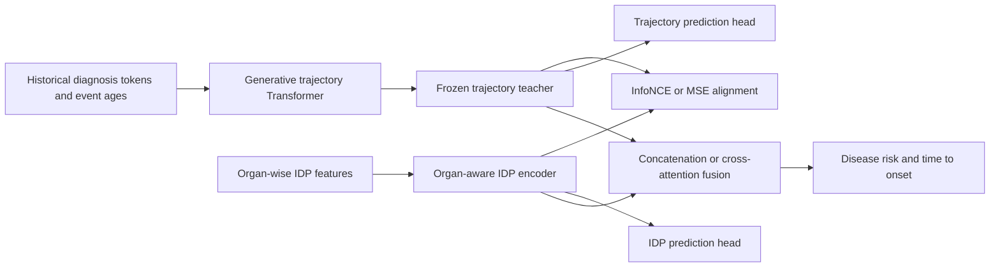

# CN4DP: From Trajectories to Phenotypes

Research code for **From Trajectories to Phenotypes: Disease Progression as Structural Priors for Multi-organ Imaging Representation Learning**.

[Paper on arXiv](https://arxiv.org/abs/2605.11958) · [中文说明](README.zh-CN.md)

CN4DP transfers information from longitudinal disease trajectories into imaging-derived phenotype (IDP) representations. A Delphi-style generative Transformer provides trajectory embeddings; an organ-wise IDP encoder learns from these embeddings through contrastive or MSE alignment. Downstream models predict disease risk and time to onset using IDPs, trajectories, or both.

This public release contains source code and configurations. All demo inputs are generated locally from independent random draws. **No UK Biobank participant data, participant identifiers, cohort exports, fitted statistics, trained research weights, notebook outputs, or original Git history are distributed.** The small synthetic demo checks the software pipeline; its metrics do not reproduce or validate the paper's findings.

## Quick start

Use Python 3.10 or newer. A CPU is sufficient for the demo.

```bash
git clone https://github.com/PrinceAnn/cn4dp.git
cd cn4dp
python -m venv .venv
source .venv/bin/activate
python -m pip install -r requirements.txt
python scripts/demo/run_demo.py
```

The command generates artificial data, prepares the teacher vocabulary and binary inputs, trains a small teacher, distills the IDP encoder, and runs IDP, trajectory and fusion predictors. Data are written to `data/demo/` and `Delphi/data/demo/`; checkpoints, CSV logs, predictions and metrics go to `runs/demo/`. These directories are ignored by Git. Re-running the demo regenerates the same toy inputs with seed 42 and writes another set of local training outputs.

To also run the optional missing-feature imputation experiment:

```bash
python scripts/demo/run_demo.py --with-imputation
```

The release was checked with Python 3.12, PyTorch 2.5.1 (CPU) and Lightning 2.6.6. Install the appropriate PyTorch build for your CUDA environment when running larger experiments.

## Method and implementation



The phenotype encoder supports a concatenated MLP baseline and organ encoders with concatenation, learned weighted pooling, or Transformer aggregation. The current cross-attention implementation uses the **aggregated IDP embedding** as a query over trajectory token states. It does not use separate organ queries as described in the paper's conceptual formulation; see `CrossAttentionFusion` in the fusion trainer when adapting that variant.

| Component | Entrypoint / configuration |
| --- | --- |
| Generate artificial cohorts | `scripts/demo/generate_synthetic.py` |
| Convert a normalized onset table to teacher inputs | `Delphi/data/prepare_cn4dp.py` |
| Train trajectory teacher | `Delphi/train.py`, `Delphi/config/train_demo.py` |
| Distill the phenotype encoder | `scripts/distill/train_align.py`, `configs/demo/distill.yaml` |
| IDP predictor from scratch / pretrained | `scripts/downstream/train_phenotype.py`, `idp_scratch.yaml` / `idp_pretrained.yaml` |
| Trajectory predictor | `scripts/downstream/train_delphi_trajectory_head.py`, `trajectory.yaml` |
| Concatenation / attention fusion | `scripts/downstream/train_fusion_delphi_phenotype.py`, `fusion_concat.yaml` / `fusion_xattn.yaml` |
| Generative scoring baseline | `scripts/downstream/eval_delphi_generative_baseline.py`, `generative.yaml` |
| Optional imputation extension | `scripts/imputation/`, `configs/demo/imputation.yaml` |

The imputation scripts are an additional experimental extension. They are kept separate from the paper's main prediction pipeline and do not include private experiment reports or results.

## Run individual stages

Run commands from the repository root, except for the teacher training command shown in its subshell.

```bash
python scripts/demo/generate_synthetic.py
python Delphi/data/prepare_cn4dp.py \
  --input-csv data/demo/disease_onsets.csv \
  --exclude-csv data/demo/phenotypes_all.csv \
  --output-dir Delphi/data/demo --val-ratio 0.2
(cd Delphi && python train.py config/train_demo.py)
python scripts/distill/train_align.py --config configs/demo/distill.yaml
python scripts/downstream/train_phenotype.py --config configs/demo/idp_pretrained.yaml
python scripts/downstream/train_delphi_trajectory_head.py --config configs/demo/trajectory.yaml
python scripts/downstream/train_fusion_delphi_phenotype.py --config configs/demo/fusion_xattn.yaml
python scripts/downstream/eval_delphi_generative_baseline.py --config configs/demo/generative.yaml
```

The teacher demo runs 20 iterations; distillation and downstream examples run two epochs. The example encoder has five artificial organ groups and 20 arbitrary features. Change `loss` in the distillation YAML to `mse` to run MSE alignment; `contrastive.temperature` controls InfoNCE temperature.

## Data interface for authorized local research

Convert your approved data locally to the normalized tables below. The repository does not provide a cohort-specific extraction script or field mapping.

| Table | Required columns and meaning |
| --- | --- |
| Phenotypes | `eid`: local integer subject key; numeric features named `organ__feature_name`; one row per subject |
| Basic information | `eid`, `birth_year` (numeric), `imaging_date` (`YYYY-MM-DD`) |
| Disease onsets | `eid`, one column per diagnosis vocabulary label; first-onset **age in years**; blank for no recorded onset |
| Downstream assignments | `eid`, `split`, where `split` is `train`, `val` or `test` |
| Risk sets | `eid`, `disease`, `label`, `imaging_date`, `delta_time`; sampling also records `matched_to`, `case_time` and `split` |
| Teacher vocabulary | `labels.csv`, created by the converter; reserved padding/no-event entries followed by event labels |

The name `eid` is only a join key; demo IDs are consecutive integers invented by the generator. Toy diagnosis names such as `SYN_TARGET` and feature names such as `heart__feature_001` have no correspondence to real participant records or restricted field identifiers.

Event ages are converted to days using 365.25 days per year. The converter writes `uint32` records `(subject_id, age_days, token_id)` and the teacher batch loader shifts event IDs by one to reserve padding. Use the vocabulary produced by the same converter for all subsequent stages. Birth-year-only input approximates imaging age; research requiring exact chronology should adapt the interface to the available precision.

Partition subjects into mutually exclusive **teacher**, **distillation** and **downstream** cohorts before training. Within the downstream cohort, assign subjects to train/validation/test **before** sampling controls, then use the same `split_csv` in every predictor:

```bash
python scripts/build_idp_riskset.py \
  --idp data/demo/phenotypes_downstream.csv \
  --basic data/demo/basic_info.csv \
  --disease data/demo/disease_onsets.csv \
  --disease-cols SYN_TARGET --K 2 \
  --split-csv data/demo/downstream_splits.csv \
  --out data/demo/riskset.csv
```

Cases have target onset strictly after imaging. Controls must already be imaged and remain target-event-free at the matched case time. This generic sampler assumes continued observation through the relevant case time; it has no censoring/end-of-follow-up column. Adapt eligibility to your cohort's follow-up information before using it for research.

The public examples use strict pre-imaging diagnosis truncation for distillation and prediction. The frozen teacher never sees imaging-cohort subjects during teacher training. Subject-based downstream splitting keeps repeated case/control appearances in one partition. Standardization is fitted on training subjects, or reused from the separate distillation checkpoint. The paper's full cohort construction, quality control, disease selection and multi-seed evaluation require separately authorized inputs and an appropriate experimental protocol; they are not reconstructed by this toy generator.

## Repository layout

```text
Delphi/                  Vendored teacher code, converter and upstream license
phenotype_encoder/       MLP and organ-aware phenotype encoders
configs/demo/            Small, portable synthetic examples
scripts/demo/            Artificial data generator and pipeline runner
scripts/distill/         Online teacher/student alignment
scripts/downstream/      Risk, onset-time and fusion training
scripts/imputation/      Optional missing-feature experiments
tests/                   Synthetic-data and release checks
```

## Validation and public release checks

```bash
python -m pip install -r requirements-dev.txt
python -m pytest -q
python scripts/check_public_release.py
```

The release checker scans tracked text files for data artifacts, symlinks, model weights, machine paths, cohort-style field headers and common credential formats. Review the staged diff as well: this check detects specific mistakes and cannot prove that arbitrary text is free of sensitive information. Do not force-add local datasets or checkpoints. A fresh Git history prevents this release from carrying prior local commits; it does not remove old branches or previously published objects from a remote repository.

## Citation and third-party code

```bibtex
@article{wang2026trajectories,
  title={From Trajectories to Phenotypes: Disease Progression as Structural Priors for Multi-organ Imaging Representation Learning},
  author={Wang, Zian and Lan, Lizhen and Wang, Guangming and Zhang, Haosen and Xu, Minxuan and Li, Qing and He, Tianxing and Yang, Mo and Mao, Wenyue and Zhang, Yajing and Li, Yan and Wang, Chengyan},
  journal={arXiv preprint arXiv:2605.11958},
  year={2026},
  doi={10.48550/arXiv.2605.11958},
  url={https://arxiv.org/abs/2605.11958}
}
```

The teacher builds on [Gerstung Lab's Delphi](https://github.com/gerstung-lab/Delphi). Its code license is retained in [Delphi/LICENSE](Delphi/LICENSE); see [THIRD_PARTY.md](THIRD_PARTY.md) for provenance and the scope of that license. No upstream or research model weights are bundled.
